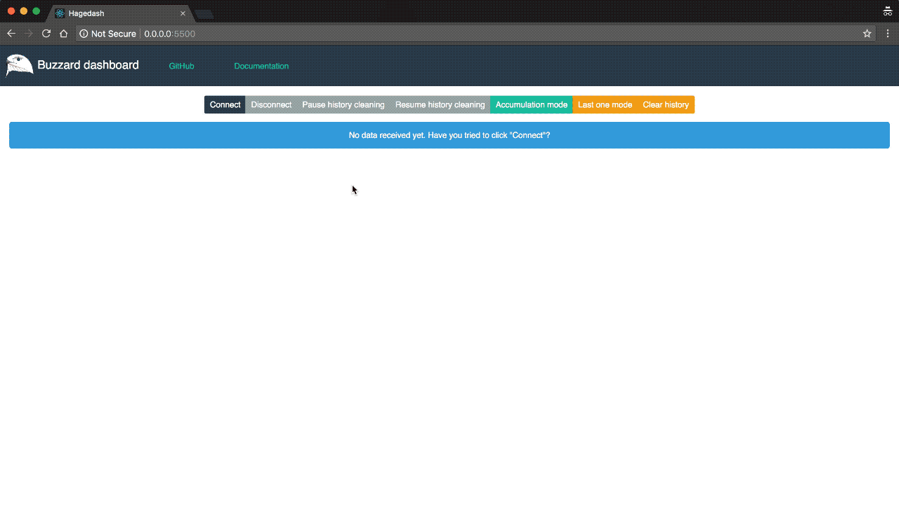

# hagedash

Realtime dashboard to support [`buzzard`](https://www.github.com/airware/buzzard) next iteration monitoring and debug.

Temporary hosted on https://github.com/HerveNivon/hagedash. This repository also hosts a built version of the dashboard (`client/build/`).

<div align="center">
  <br />
</div>

## Launching the dashboard server

### Python 2.7

```
$> cd client/build
$> python -m SimpleHTTPServer 3000
```

### Python 3.6

```
$> ./hagedash.py
```

Which is mostly equivalent to `python3 -m http.server`

## Development

The `hagedash` dashboard is a [react](https://reactjs.org) application located in the `client` folder of this repository.

### Pre requisites

You must have `node` and `npm` installed to develop and build the `hagedash` dashboard.

You should also install the [Redux DevTools](https://chrome.google.com/webstore/detail/redux-devtools/lmhkpmbekcpmknklioeibfkpmmfibljd?hl=en). This will help you understand which are the dispatched actions and interactions with the store in addition with the ability to replay events.

### Starting the Mock websocket server

To launch a websocket server that mocks the `buzzard` expected data entries execute the following.

```
$> ./hagedash_mock.py
```

It will create a websocket server on `http://localhost:8001/websocket`.

### Starting the dashboard for development purpose

To start the dashboard in live reload mode (the page refresh with every change in the source code):
```
$> cd client
$> npm start
```

See [`client/README.md`](client/README.md) for more information.

### Debugging in the Editor

Debugging the dashboard in the Editor has only been tested in [Visual Studio Code](https://code.visualstudio.com/).

This enables you as a developer to write and debug the web application code without leaving the editor.

You would need to have the latest version of [VS Code](https://code.visualstudio.com/) and [VS Code Chrome Debugger Extension](https://marketplace.visualstudio.com/items?itemName=msjsdiag.debugger-for-chrome) installed.

Start your app by running `npm start`, and start debugging in VS Code by pressing `F5` or by clicking the green debug icon of the debugger panel. You can now write code, set breakpoints, make changes to the code, and debug your newly modified code — all from your editor.

See [Debugging in the Editor](https://github.com/facebook/create-react-app/blob/master/packages/react-scripts/template/README.md#debugging-in-the-editor) for additional details regarding other editors.

### Linting

With https://github.com/facebook/create-react-app/pull/3850 still open as of 25th of July, the following is present in `client/package.json` to allow execution of linting from the command line - with `npm run lint` - instead of having to launch the application with `npm start` and wait for lint errors:

```json
{
  ...
  "scripts": {
    ...
    "lint": "node node_modules/eslint/bin/eslint.js src/"
  }
}
```

This also allow you to automatically fix certain linting errors with:
```
$> npm run lint -- --fix
```

We are using the [airbnd linting settings](https://www.npmjs.com/package/eslint-config-airbnb) as it helps producing way better results.
Unfortunately, as of 2018-08, you are encountering the following message when you `npm install` because linting setting of `CRA` and `Airbnb` are not [compatible](https://github.com/facebook/create-react-app/issues/3540):
```
$> npm WARN eslint-config-react-app@2.1.0 requires a peer of eslint-plugin-jsx-a11y@^5.1.1 but none is installed. You must install peer dependencies yourself.
```

Normally this would lead to warnings when you execute `npm rum lint`. Thanks to the custom following `.eslintrc` configuration, this is avoided:
```
{
  "extends": [
    "react-app",
    "airbnb"
  ],
  "rules": {
    "react-app/jsx-a11y/href-no-hash": "off",
    "jsx-a11y/href-no-hash": "off"
  }
}
```

## Building the dashboard

```
$> cd client
$> npm run build
```

Commit the last build

## Development todo
1. [X] Set the development pipeline (https://reactjs.org/docs/create-a-new-react-app.html)
2. [X] Build the data management through websockets
3. [X] Build the bar charts
4. [X] Build the donut chart
5. [X] Build the timeline chart
6. [X] Build the brush over timeline for selection
7. [X] Build the sankey diagram
8. [X] Set the building process for distribution along with `buzzard`
9. [X] Make the distribution trough `./hagedash.py`
10. [ ] ~~Dispatch the "Connect" action automatically on page load~~
11. [X] Stop automatic re-connection on manual disconnect
12. [X] Change logo and header
13. [X] Add bootstrap to make things nicer
14. [ ] `buzzardReducer.js`: Data validation in the websocket handler
15. [X] Optimized computed properties (in order to avoid their computation within all components)
16. [ ] Add tests 😇
17. [X] Update `App.js` `brushExtent` when data update
- A working implementation is done in `src/containers/Selector.js (l. 75)` but it stops the React event loop
- Use Redux instead, move the filtering action and brushextent to the redux in `src/reducers/buzzardReducer.js`
18. [X] Add number of event as bar on the selector
19. [ ] Enhance performances:
- with `shouldComponentUpdate` http://buildwithreact.com/article/optimizing-with-shouldcomponentupdate or `componentWillReceiveProps`
- https://medium.com/@tibotiber/react-d3-js-balancing-performance-developer-experience-4da35f912484
20. [ ] Moves as much as possible data preparation from `src/containers/Pools.js` to redux in `src/reducers/buzzardReducer.js`
21. [ ] When filtered data is empty display a message instead of nothing
22. [ ] Replace d3-svg-legend by native d3
- It has a bug with react, adding unwanted values to the range resulting in color dilution
- It doesn't work with long names
23. [ ] `src/containers/Selector.js`: When the brush selector is activated, highlight the underlying bars
24. [X] Implement array of queries and rasters
25. [ ] Replace `<div>` with [`react-strap`](https://reactstrap.github.io/) bindings when possible. `react-strap` is already setup
26. [ ] `src/containers/Network.js`: highlight querries on `mouseover` event (greyout or set opacity of other `paths` to 0.5 for instance)
99. [ ] Bug Fixing:
- [X] When we disconnect, and we clear history, the Pools remain fixed on the last values
- [ ] `src/containers/Pools.js`: Resizing donut charts doesn't work when screens are really small (because of `src/containers/Piechart.js (l. 39)`)
- [ ] `src/containers/Selector.js`: the d3.event cannot be accessed. Therefore a tricky fix has been implemented in `function brushed()` accessing a private object
- [X] When "Clear History" action is dispatch, the extent remains with the old value, this will be solved moving everything to redux
- [X] `src/containers/Network.js`:When the data accumulated of a periode of 5 minutes, the scale bar of the selector is not updated
- [ ] `src/containers/Network.js`: Event `mouseout` is not working. For others cases, [Chrome Devtools](https://developers.google.com/web/tools/chrome-devtools/console/events) have proven themselves helpful
- [ ] `src/containers/Network.js`: the size of nodes is based on the value of the links attached to. As the value of links is the pixel size, and the pixel size is not coherent it may lead to unwanted display behavior

## Lectures

d3.js:
- https://github.com/d3/d3/wiki/gallery
- [Interactive drop down](http://bl.ocks.org/jonahwilliams/2f16643b999ada7b1909)
- Brush:
  - [brush snapping](https://bl.ocks.org/mbostock/6232537)
  - [brush and zoom](https://bl.ocks.org/mbostock/34f08d5e11952a80609169b7917d4172)
  - [scatterplot brush](https://rajvansia.com/scatterplotbrush-d3-v4.html)
  - https://www.visualcinnamon.com/2016/07/brush-bar-chart-d3.html
  - http://bl.ocks.org/nbremer/326fb6de768e85261bfd47aa1f497863
- Pie charts:
  - [D3 Donut Chart @Observable](https://beta.observablehq.com/@mbostock/d3-donut-chart)
  - [reusable donut chart](https://bl.ocks.org/mbhall88/b2504f8f3e384de4ff2b9dfa60f325e2)
  - [Pie Chart Update, V](https://bl.ocks.org/mbostock/5682158)
  - [Pie Chart](https://bl.ocks.org/mbostock/3887235)
- Sankey
  - Interactive sankey (no dcjs but d3v3):
    - https://bl.ocks.org/wvengen/2a71af9df0a0655a470d
    - https://github.com/q-m/d3.chart.sankey
  - [official d3js v4 sankey](https://github.com/d3/d3-sankey)
  - [Sankey MBostock](https://beta.observablehq.com/@mbostock/d3-sankey-diagram)
  - [2018 San Francisco Major Ranked Choice Voting](https://beta.observablehq.com/@eliaslevy/2018-san-francisco-major-ranked-choice-voting)
- [Toward reusable charts](https://bost.ocks.org/mike/chart/)
- Various:
  - [d3-legend](http://d3-legend.susielu.com/)

react & d3:
- D3.js in action chapter 9: https://github.com/emeeks/d3_in_action_2/tree/master/chapter9
- [React & D3 v4 example - Enter,Update,Exit Transition](https://bl.ocks.org/shimizu/7b198ba0dd29ccbba60c35a8b2d33160)
- [Silky smooth Piechart transitions with React and D3.js](https://swizec.com/blog/silky-smooth-piechart-transitions-react-d3js/swizec/8258)
  - [Repo](https://github.com/Swizec/react-d3-pie/blob/master/src/App.js)
- [How to Make a Piechart using React and d3](https://swizec.com/blog/how-to-make-a-piechart-using-react-and-d3/swizec/6785)
- [React + D3v4 • Rusable Datavis & animations using modern javascript](https://swizec.com/reactd3js/)


react, redux, websockets:
- https://medium.com/@ianovenden/redux-websocket-integration-c1a0d22d3189
- https://www.ibm.com/developerworks/library/wa-manage-state-with-redux-p1-david-geary/
- https://medium.com/backticks-tildes/setting-up-a-redux-project-with-create-react-app-e363ab2329b8

- https://github.com/giantmachines/redux-websocket/pull/8/files
- https://gist.github.com/dmichael/9dc767fca93624df58b423d01e485402

- https://medium.com/@notrab/getting-started-with-create-react-app-redux-react-router-redux-thunk-d6a19259f71f
- https://medium.com/@andrewdrummond_52198/04-what-the-thunk-is-react-redux-pt-2-3994c57c09c1

- https://www.fullstackreact.com/30-days-of-react/day-19/
- https://github.com/markerikson/redux-ecosystem-links/blob/master/middleware-sockets-adapters.md
- https://github.com/reduxjs/redux-thunk
- https://blog.logrocket.com/beyond-rest-using-websockets-for-two-way-communication-in-your-react-app-884eff6655f5
- Serving a create-react-app with Flask: https://stackoverflow.com/questions/44209978/serving-a-create-react-app-with-flask
- (interesting, not that much): https://peteris.rocks/blog/real-time-stats-with-websockets-and-react/

data:
- [Use d3 to manipulate nested data](http://learnjsdata.com/group_data.html)

d3.js, dc.js, crossfilters:
- Interactive Sankey (d3v3): http://bl.ocks.org/tonmcg/570fb0409b6c59768229d5631bc3d77e
- Earthquake, interactive dashboard and brush filter (and brush style): http://bl.ocks.org/d3noob/6077996

Realtime dashboard with websockets:
- https://react.rocks/tag/Realtime
- https://react.rocks/tag/WebSockets
- https://react.rocks/example/iTunes-Remote
- https://www.youtube.com/watch?v=Lc2TA0-gZqg
- https://peteris.rocks/blog/real-time-stats-with-websockets-and-react/

dataviz:
- [Hybrid Sankey diagrams: Visual analysis of multidimensional data for understanding resource use](https://www.sciencedirect.com/science/article/pii/S0921344917301167?via%3Dihub)

css:
- https://getbootstrap.com/docs/4.1/getting-started/introduction/
- [react + bootstrap](https://reactstrap.github.io/components/buttons/)

python:
- https://python-socketio.readthedocs.io/en/latest/
